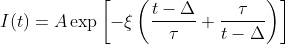
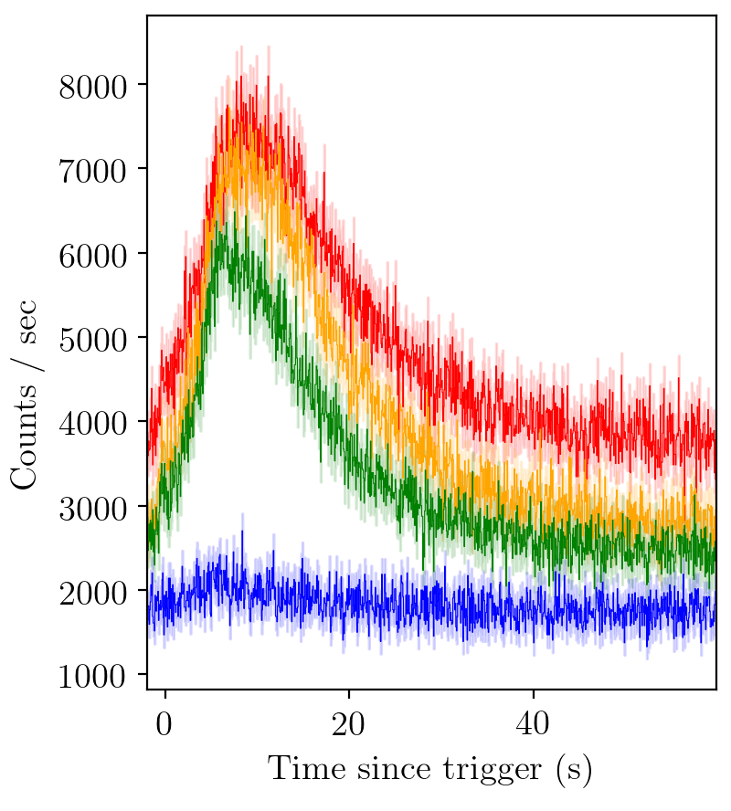

|Travis| |Coverage| |Docs| |AstroPy|

=====
PyGRB
=====

.. inclusion-marker-one-liner-start

A GRB light-curve analysis package.

.. inclusion-marker-one-liner-end

.. inclusion-marker-what-it-does-start

Introduction
------------
*PyGRB* is a package to download GRB .FITS files from the relevant data archives (eg. NASA HEARSAC).
At the moment only `BATSE <https://heasarc.gsfc.nasa.gov/FTP/compton/data/batse/>`_ data can be downloaded and analysed with the software, although with only slight tweaks GRBs from other satellites can be easily analysed.
The code is then able to create light-curves from either pre-binned data or time-tagged photon-event data.
Light-curves may then be fitted with with pulse models, for further analysis.
Model fitting is done with nested sampling, powered by `Bilby <https://lscsoft.docs.ligo.org/bilby/index.html>`_, and `Dynesty <https://dynesty.readthedocs.io/>`_ and/or `Nestle <https://github.com/kbarbary/nestle>`_.

Installation
------------
The *PyGRB* repository maybe be installed manually through cloning the repository

.. code-block:: console

  $ git clone https://github.com/JamesPaynter/PyGRB
  $ cd PyGRB
  $ pip install -r requirements.txt
  $ pip install .

or by downloading the compiled version from `PyPI <https://pypi.org/project/PyGRB/>`_

.. code-block:: console

  $ pip install pygrb

Installation of *PyGRB* and its dependencies should take no longer than a couple of minutes.

Then import *PyGRB* through ``import PyGRB``.

.. inclusion-marker-what-it-does-end

.. inclusion-marker-pulse-types-start

Pulse types
------------
Description of GRB pulse phenomenology.

.. inclusion-marker-pulse-types-end

`See documentation for more <https://pygrb.readthedocs.io/en/latest/user/pulses.html>`_

.. role:: python(code)
   :language: python

    BATSE trigger 7475

Usage
------

.. inclusion-marker-usage-start

Say we would like to fit a GRB light-curve such as the above, and determine its pulse parameters.
First we must load the relevant modules.

.. code-block:: python

  from PyGRB.main.fitpulse import PulseFitter
  from PyGRB.backend.makemodels import create_model_from_key

The :python:`PulseFitter` class is the main workhorse of the software.

.. code-block:: python

  GRB = PulseFitter(7475, times = (-2, 60),
            datatype = 'discsc', nSamples = 200, sampler = 'nestle',
            priors_pulse_start = -5, priors_pulse_end = 30)

The first argument specifies the BATSE trigger to be analysed, in this case trigger 7475.
Times can either be specified as :python:`'T90'`, :python:`'full'`, or a tuple of start and end times.
In the case of trigger 7475, most of the action happens over about (-2, 60), so we choose this interval for our times.
The :python:`nSamples` parameter determines how many live points the nested sampler is initiated with.
The :python:`sampler` parameter is used to choose between samplers.
The :python:`priors_pulse_start` and :python:`priors_pulse_end` parameters are used to set the (uniform) interval over which the program will allow the pulse start times.
The :python:`datatype` parameter specifies which kind of data we would like to download and analyse.
Typically :python:`'discsc'` is the most useful.
:python:`'tte'` is better for short GRBs.
The data will be downloaded and stored in :code:`data/`.

:python:`create_model_from_key` allows us to specify pulse models based on a simple key. The simple pulse type, a fast-rise exponential-decay (FRED) pulse, is utilised by

.. code-block:: python

  key = 'F'
  model = create_model_from_key(key)

Finally, we run the model through the sampler

.. code-block:: python

  GRB.main_multi_channel(channels = [0, 1, 2, 3], model = model)

The data products are stored in :code:`products/`.

.. inclusion-marker-usage-end

We should be left with a light-curve that looks like this:

.. figure:: docs/source/images/B_7475__d_NL200__rates_F.png
    :figwidth: 50%
    :width: 80%
    :align: center
    :alt: BATSE trigger 7475

    BATSE trigger 7475 with FRED fit

`See documentation for more <https://pygrb.readthedocs.io/en/latest/user/usage.html>`_

Under the Hood
---------------

.. image:: docs/source/images/pulse_fit_animation.gif
    :align: center
    :alt: a GRB light-curve fit animation

There is a typo in this animation, the two fractions should take the same sign (+ve).
The -2 is an amplitude normalisation factor.

`See documentation for more <https://pygrb.readthedocs.io/en/latest/user/sampling.html>`_

Contribute
----------
- Include support for uneven bin sizes and data gaps.

- Include compatability with other GRB catalogues that are publicly available.

  - `Swift BAT <https://swift.gsfc.nasa.gov/results/batgrbcat/>`_

  - `Fermi GBM <https://heasarc.gsfc.nasa.gov/FTP/fermi/data/gbm/bursts/>`_

  - `Konus Wind <https://gcn.gsfc.nasa.gov/konus_grbs.html>`_

- Include capabaility to download and plot GRB spectra in addition to light-curves.

- Increase coverage to 100%

Coverage
--------

.. figure:: https://codecov.io/gh/JamesPaynter/PyGRB/branch/master/graphs/sunburst.svg
    :width: 20%
    :align: center
    :alt: Codecov Sunburst

.. |AstroPy| image:: http://img.shields.io/badge/powered%20by-AstroPy-orange.svg?style=flat
    :target: http://www.astropy.org/
    :alt: astropy

.. |Travis| image:: https://travis-ci.com/JamesPaynter/PyGRB.svg?branch=master
  :alt: Travis Badge
  :target: https://travis-ci.com/JamesPaynter/PyGRB

.. |Coverage| image:: https://codecov.io/gh/JamesPaynter/PyGRB/branch/master/graph/badge.svg
    :target: https://codecov.io/gh/JamesPaynter/PyGRB
    :alt: CodeCov - Coverage Status

.. |Docs| image:: https://readthedocs.org/projects/pygrb/badge/?version=latest
    :target: https://pygrb.readthedocs.io/en/latest/?badge=latest
    :alt: Documentation Status
