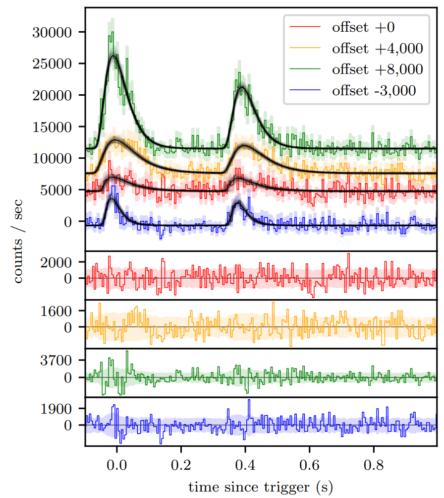
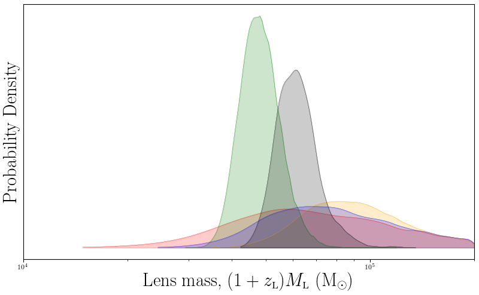

.. _3770:

.. role:: python(code)
   :language: python

GRB 950830 basic analysis
-------------------------

   BATSE trigger 3770 with FRED lens fit.

This script compares the two simplest pulse models for a gravitational lensing event for GRB 950830.

----

.. literalinclude:: ../../../../examples/gravlensnaturebasic.py
    :name: gravlensnaturebasic.py
    :caption: gravlensnaturebasic.py

----

Channel 1

+-------+---------+-------+-------+
| Model |   ln Z  | error | ln BF |
+-------+---------+-------+-------+
| FL    | -692.95 |  0.29 |  3.75 |
+-------+---------+-------+-------+
| FF    | -696.70 |  0.31 |  0.00 |
+-------+---------+-------+-------+

Channel 2

+-------+---------+-------+-------+
| Model |   ln Z  | error | ln BF |
+-------+---------+-------+-------+
| FL    | -663.86 |  0.32 |  6.67 |
+-------+---------+-------+-------+
| FF    | -670.53 |  0.36 |  0.00 |
+-------+---------+-------+-------+

Channel 3

+-------+---------+-------+-------+
| Model |   ln Z  | error | ln BF |
+-------+---------+-------+-------+
| FL    | -719.66 |  0.34 |  5.16 |
+-------+---------+-------+-------+
| FF    | -724.82 |  0.39 |  0.00 |
+-------+---------+-------+-------+

Channel 4

+-------+---------+-------+-------+
| Model |   ln Z  | error | ln BF |
+-------+---------+-------+-------+
| FL    | -629.50 |  0.30 |  0.86 |
+-------+---------+-------+-------+
| FF    | -630.36 |  0.35 |  0.00 |
+-------+---------+-------+-------+

The total ln evidence in favour of lensing is 16.38, which is considered strong evidence.
Thus this gamma-ray burst warrants further investigation.

.. figure:: ../../images/B_3770_YL2000__delmu_delt.png
    :figwidth: 80%
    :width: 100%
    :align: center
    :alt: BATSE trigger 3770 magnification ratio and time delay posterior histogram.

    BATSE trigger 3770 magnification ratio and time delay posterior histogram.

The magnification ratios and time delays are concordant, as one would expect from a gravitational lensing event.

    BATSE trigger 3770 lens mass posterior histogram.

The inferred lens mass suggests an intermediate mass black hole as the gravitational deflector.
