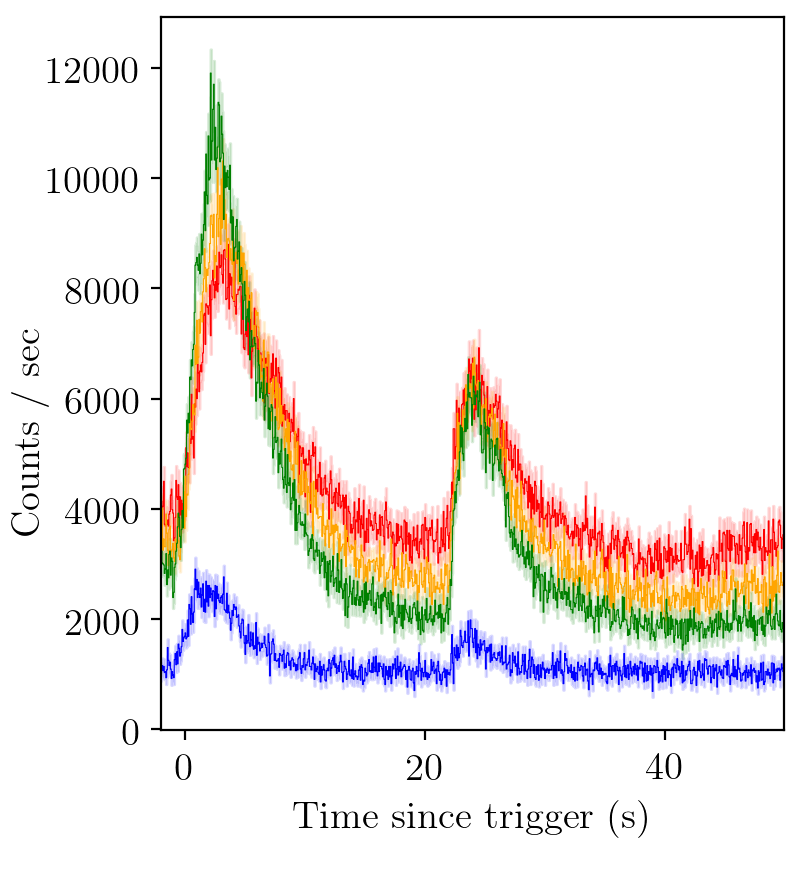

.. _973:

.. role:: python(code)
   :language: python

GRB 911031
----------

   BATSE trigger 973.

----

.. literalinclude:: ../../../../examples/gravlens.py
   :name: gravlens.py
   :caption: gravlens.py

----

Channel 1 (red)

+-------+----------+-------+--------+
| Model |   ln Z   | error | ln BF  |
+-------+----------+-------+--------+
| FL    | -3852.93 |  0.60 |  0.00  |
+-------+----------+-------+--------+
| FF    | -3623.66 |  0.67 | 229.27 |
+-------+----------+-------+--------+

Channel 2 (orange)

+-------+----------+-------+--------+
| Model |   ln Z   | error | ln BF  |
+-------+----------+-------+--------+
| FL    | -3967.64 |  0.61 |  0.00  |
+-------+----------+-------+--------+
| FF    | -3665.85 |  0.68 | 301.79 |
+-------+----------+-------+--------+

Channel 3 (green)

+-------+----------+-------+--------+
| Model |   ln Z   | error | ln BF  |
+-------+----------+-------+--------+
| FL    | -4014.63 |  0.62 |  0.00  |
+-------+----------+-------+--------+
| FF    | -3640.90 |  0.70 | 373.73 |
+-------+----------+-------+--------+

Channel 4 (blue)

+-------+----------+-------+-------+
| Model |   ln Z   | error | ln BF |
+-------+----------+-------+-------+
| FL    | -2986.56 |  0.57 |  0.00 |
+-------+----------+-------+-------+
| FF    | -2970.48 |  0.62 | 16.08 |
+-------+----------+-------+-------+

We see that the Bayesian evidence strongly prefers a two pulse model.

Notes
^^^^^
If you want to fit two pulses, one FRED and one FRED-X, but you do not know the order in which you would like to fit them in (eg. the two pulses are overlapping), then you will need to do both a ['FX'] model and a ['XF'] model.
The best fitting model is then the one with the higher Bayesian evidence.
This is because the order of the pulses is automatically encoded in the priors.
We do this so that the results are unimodal for degenerate cases, eg ['FF'].
