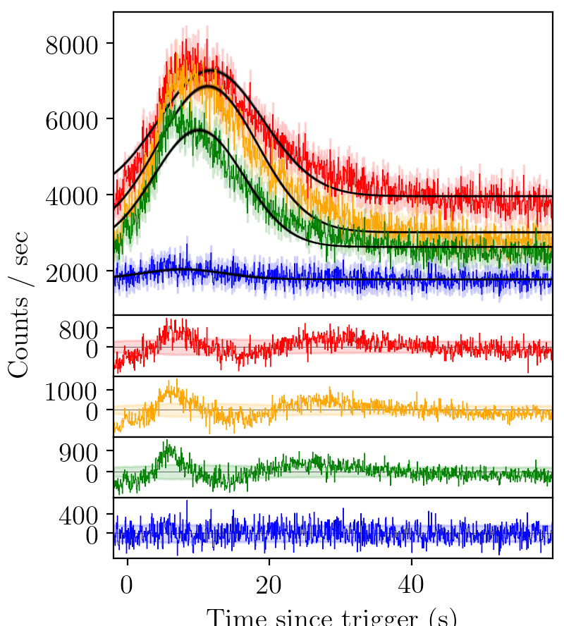
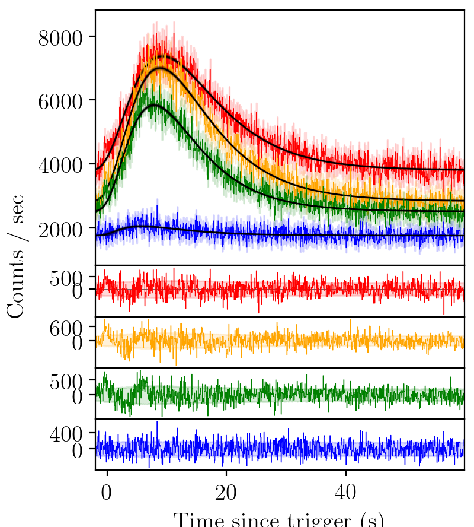

Pulse Types
===========

.. role:: python(code)
   :language: python

A standard gamma-ray burst looks like the following

.. figure:: ../images/BATSE_trigger_7475_rates_rates.png
    :figwidth: 80%
    :width: 100%
    :align: center
    :alt: BATSE trigger 7475

    BATSE trigger 7475

A simple pulse parameterisation one might imagine is a Gaussian, like those used to model emission lines in eg. quasar spectra.
The equation for a Gaussian pulse is:

.. math::

    S(t|A,\Delta,\sigma) = A \exp \left[ \frac{\left( t - \Delta \right)^2}{2\sigma^2} \right]

    BATSE trigger 7475 with gaussian fit

However, we can immediately see that such a pulse parameterisation does not catch the fast rise of the GRB pulse, nor the slow decay.
The residuals have consistent structure.
The standard pulse parameterisation used to model gamma-ray bursts is a fast-rise exponential-decay (FRED) curve.

.. math::

    S(t|A,\Delta,\tau,\xi) = A \exp \left[ - \xi \left(  \frac{t - \Delta}{\tau} + \frac{\tau}{t-\Delta}  \right)   \right]

.. figure:: ../images/B_7475__d_NL200__rates_F.png
    :figwidth: 80%
    :width: 100%
    :align: center
    :alt: BATSE trigger 7475 with FRED fit

    BATSE trigger 7475 with FRED fit

The fit is better than a Gaussian, but again there is structure un-accounted for in the residuals.
We try again with an extended fast-rise exponential-decay model, FRED-X.

.. math::

    S(t|A,\Delta,\tau,\xi,\gamma,\nu) = A \exp \left[ -\xi^\gamma \left(\frac{t - \Delta}{\tau}\right)^\gamma - \xi^\nu \left(\frac{\tau}{t-\Delta}\right)^\nu\right]

    BATSE trigger 7475 with FRED-X fit

Again, an element of structure in the residual persists.
We use a sine-gaussian residual function to account for these residuals.

.. math::

    \text{res}(t)= A_\text{res} \exp \left[ - \left(\frac{t-\Delta_\text{res}} {\lambda_\text{res}}\right)^2 \right] \cos\left(\omega t + \varphi \right)

    BATSE trigger 7475 with FRED fit and sine-Gaussian residual (not implemented yet)

Say, then, that we would like to fit on of each of these models in turn to the light-curve.
To create a model, we specify a list of keys.
For a Gaussian, FRED, and FRED-X pulse, the keys are as follows:

.. code-block:: python

  keys = ['G', 'F', 'X']

Residuals are included by placing a lower case :python:`'s'` following the pulse to which it should be applied.
Residuals must be applied following a pulse, and cannot be used as a standalone.
Let's add an additional three pulse fits, all with a residual, to our list of keys.

.. code-block:: python

  keys += ['Gs', 'Fs', 'Xs']

So our complete list would look like

.. code-block:: python

  keys = ['G', 'F', 'X', 'Gs', 'Fs', 'Xs']

Now we need to convert our keys into models for the nested sampling analysis.

.. code-block:: python

  model_dict = {}
  for key in keys:
      model_dict[key] = create_model_from_key(key)
  models = [model for key, model in model_dict.items()]

Finally, we feed each of the models in turn to the sampler through :python:`main_multi_channel`.
This function further splits the model (in this case into 4), and tests each of the channels individually.

.. code-block:: python

  for model in models:
      GRB.main_multi_channel(channels = [0, 1, 2, 3], model = model)

----

The complete script for the above tutorial is here:

.. literalinclude:: ../../../examples/intermediate.py
    :name: intermediate.py
    :caption: intermediate.py
