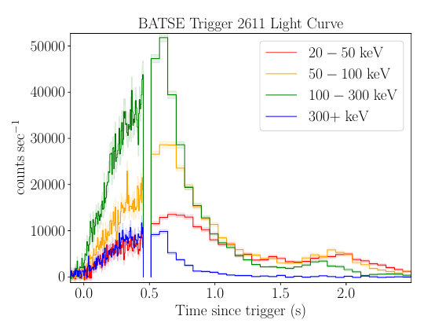

.. _sampling:

Sampling
========

.. figure:: ../images/pulse_fit_animation.gif
    :figwidth: 80%
    :width: 100%
    :align: center
    :alt: a GRB light-curve fit animation

    Animation of nested sampling converging on channel 3 of BATSE trigger 8099 with a FRED pulse fit.

The equation in the nested sampling animation should read

.. math::

    S(t|A,\Delta,\tau,\xi) = A \exp \left[ - \xi \left(  \frac{t - \Delta}{\tau} + \frac{\tau}{t-\Delta}  \right)  -2 \right]

Photon Counting
---------------

Photon emission is a stochastic process.
The mean number of photons emitted during time interval :math:`t` is

.. math::

  \left< N(t) \right> = \lambda t,

where :math:`\left< N(t) \right>` is the expectation value for :math:`N` over the integration time, with Poisson rate :math:`\lambda`.
The probability distribution for the random variable :math:`N` is

.. math::

	\Pr(N(t) = n) = \frac{(\lambda t)^n e^{-\lambda t}}{n!}

For photons :math:`\vec{\gamma}=\{\gamma_1, \gamma_2, \ldots, \gamma_n\}` emitted via a homogeneous Poisson process (:math:`\lambda(t)=\lambda`), then the inter-arrival time between photon :math:`\gamma_i` and :math:`\gamma_{i+1}` is exponentially distributed.
The inter-arrival times between photon :math:`\gamma_i` and :math:`\gamma_{i+k}` follow a gamma distribution with

.. math::

	X \sim \Gamma(k, \lambda^{-1}),

where :math:`k=1` recovers the exponential distribution

.. math::

	X \sim \exp (\lambda^{-1}).

High energy detectors like BATSE accumulate photons at discrete multiples of their clock cycles (sampling frequencies).
BATSE has a sampling frequency of 500 kHz (a clock cycle of 2 :math:`{\mu s}`).
These detectors record each photon arrival time (time-tagged event, `tte`) to the nearest integer multiple of the clock cycle.
For BATSE, hardware limitations restricted this to the first 32,768 Large Area Detector (LAD) events, inclusive of all detectors.
Only the shortest, moderately bright :math:`{\gamma}`-ray bursts are contained completely within the `tte` data.
After the `tte` period has been exhausted, BATSE counts are collected in 64ms intervals (Discriminator Science Data, `discsc`) for :math:`{\sim 240}` seconds after the trigger.

   BATSE trigger 2611. This is a short bright :math:`{\gamma}`-ray burst for which the `tte` data cuts out before the event is over.

Notes
^^^^^

Pre-trigger `tte` data is available for all 8 LADs.
Post-trigger `tte` data is available for the triggered detectors only.

BATSE sums the counts of the triggered detectors aboard the satellite.
These are then converted to rates in units of counts per second by dividing by the integration time (bin width).
To use Poisson statistics, `PyGRB` converts rates back to counts by multiplying by the bin widths, and forcing them to be integer.
This does not take into account the detector deadtime (see below).
Using rates rather than counts would underestimate the uncertainty in the radiation field, since for a Poisson distribution

.. math::

  \sigma_\text{Poisson}\sim \sqrt{N}.

A true Poisson process occurs at each detector.
The photon arrival times are convolved with the response of the detector, resulting in a Poisson distributed count spectrum.
Due to the onboard summing across triggered detectors we are forced to apply Poisson statistics to the summed counts, rather than the counts at each detector.

For :math:`{\gamma}`-ray bursts which are completely resolved in `tte` data, it is possible to analyse the counts at each detector.
However, since `PyGRB`'s main focus is the analysis of `discsc` data (prebinned), which is summed over the triggered detectors, this has not yet been implemented.
It is entirely possible to run the program independently over each triggered detector for `tte` data.
There is not yet a unified joint-likelihood framework which will consider a single radiation field across these detectors.

Dead Time
^^^^^^^^^

BATSE has a small dead time after each photon count of approximately one clock cycle.
This dead time is proportional to the energy of the incident photon (or particle event) which triggered the count.

.. :cite:`2010JGRAGjesteland`.
.. :cite:`2008GeoRLGrefenstette`

.. math::
  \tau \sim \alpha \ln \frac{E_{\gamma}}{E_0}

Where :math:`E_{\gamma}` is the energy of the incident photon, :math:`E_0= 5.5` keV is the reset level of the detector, and :math:`{\alpha}=0.75` :math:`{\mu s}` is the signal decay time.
This means that photon counting is not a true Poisson process when the count rate approaches the sampling frequency.
Rather, it follows a truncated Poisson distribution.

Poisson rate
------------

The rate passed to the likelihood function is the sum of the individual pulses, specified in :ref:`pulses`.
An example rate for two FRED pulses would be:

.. math::

    \begin{split}
    S(t|A_1,\Delta_1,\tau_1,\xi_1,A_2,\Delta_2,\tau_2,\xi_2) =
                      &A_1 \exp \left[ - \xi_1 \left(  \frac{t - \Delta_1}{\tau_1}
                              + \frac{\tau_1}{t-\Delta_1}  \right)  -2 \right] \\
                    + &A_2 \exp \left[ - \xi_2 \left(  \frac{t - \Delta_2}{\tau_2}
                              + \frac{\tau_2}{t-\Delta_2}  \right)  -2 \right]
    \end{split}

Background
^^^^^^^^^^

The background is by default modelled as a constant.
This is sufficient for all but the longest gamma-ray bursts, excepting periods of unusually high background variability.
More complex background models, such as a polynomial, can be included by specifying them as a rate function and including relevant priors.

The complete rate is then:

.. math::

  \begin{split}
  S(t|A_1,\Delta_1,\tau_1,\xi_1,A_2,\Delta_2,\tau_2,\xi_2) = B +
                    &A_1 \exp \left[ - \xi_1 \left(  \frac{t - \Delta_1}{\tau_1}
                            + \frac{\tau_1}{t-\Delta_1}  \right)  -2 \right] \\
                  + &A_2 \exp \left[ - \xi_2 \left(  \frac{t - \Delta_2}{\tau_2}
                            + \frac{\tau_2}{t-\Delta_2}  \right)  -2 \right]
  \end{split}

Likelihood
----------

The rate function is then passed into the Poisson likelihood, which is a sum of the specified rates.

Priors
------

The default priors are

+---------------------------------+------------------------------------+--------------------+--------------+--------------+
| parameter                       | minimum                            | maximum            | type         | units        |
+---------------------------------+------------------------------------+--------------------+--------------+--------------+
| :math:`\Delta_i`                | \-\-                               | \-\-               | uniform      | seconds      |
+---------------------------------+------------------------------------+--------------------+--------------+--------------+
| :math:`\Delta_{i+1}`            | :math:`\Delta_i`                   | \-\-               | uniform      | seconds      |
+---------------------------------+------------------------------------+--------------------+--------------+--------------+
| :math:`B`                       | :math:`10^{-1}`                    | :math:`10^{3}`     | log\-uniform | counts / bin |
+---------------------------------+------------------------------------+--------------------+--------------+--------------+
| :math:`A`                       | :math:`10^{0}`                     | :math:`10^{5}`     | log\-uniform | counts / bin |
+---------------------------------+------------------------------------+--------------------+--------------+--------------+
| :math:`\tau`                    | :math:`10^{-3}`                    | :math:`10^{3}`     | log\-uniform | seconds      |
+---------------------------------+------------------------------------+--------------------+--------------+--------------+
| :math:`\xi`                     | :math:`10^{-3}`                    | :math:`10^{3}`     | log\-uniform | \-\-         |
+---------------------------------+------------------------------------+--------------------+--------------+--------------+
| :math:`\gamma`                  | :math:`10^{-1}`                    | :math:`10^{1}`     | log\-uniform | \-\-         |
+---------------------------------+------------------------------------+--------------------+--------------+--------------+
| :math:`\nu`                     | :math:`10^{-1}`                    | :math:`10^{1}`     | log\-uniform | \-\-         |
+---------------------------------+------------------------------------+--------------------+--------------+--------------+
| :math:`\Delta_\text{res}`       | \-\-                               | \-\-               | uniform      | seconds      |
+---------------------------------+------------------------------------+--------------------+--------------+--------------+
| :math:`A_\text{res}`            | :math:`10^{0}`                     | :math:`10^{3}`     | log\-uniform | counts / bin |
+---------------------------------+------------------------------------+--------------------+--------------+--------------+
| :math:`\tau_\text{res}`         | :math:`10^{-3}`                    | :math:`10^{3}`     | log\-uniform | counts / bin |
+---------------------------------+------------------------------------+--------------------+--------------+--------------+
| :math:`\omega`                  | :math:`10^{-3}`                    | :math:`10^{3}`     | log\-uniform | \-\-         |
+---------------------------------+------------------------------------+--------------------+--------------+--------------+
| :math:`\varphi`                 | :math:`-\pi`                       | :math:`\pi`        | uniform      | radians      |
+---------------------------------+------------------------------------+--------------------+--------------+--------------+

The priors on :math:`\Delta_i` and :math:`\Delta_\text{res}` are determined by the length of the light-curve passed to `PulseFitter`.

Further reading
---------------

For more on nested sampling, the reader is referred to the following links.

https://lscsoft.docs.ligo.org/bilby/basics-of-parameter-estimation.html

https://dynesty.readthedocs.io/en/latest/overview.html

https://dynesty.readthedocs.io/en/latest/dynamic.html

.. BATSE Data Types
.. ----------------
..
.. , and in (Time-to-Spill, `tts`),

References
----------

`BATSE Appendix G <https://heasarc.gsfc.nasa.gov/docs/cgro/nra/appendix_g.html#V.%20BATSE%20GUEST%20INVESTIGATOR%20PROGRAM>`_

.. bibliography:: ../refs.bib
  :style: unsrt
