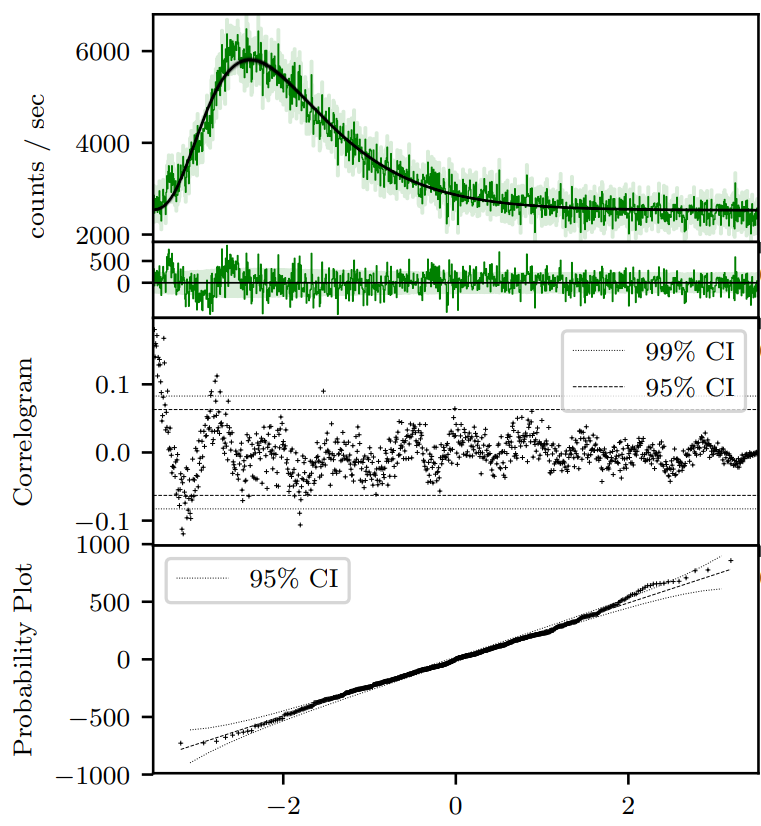
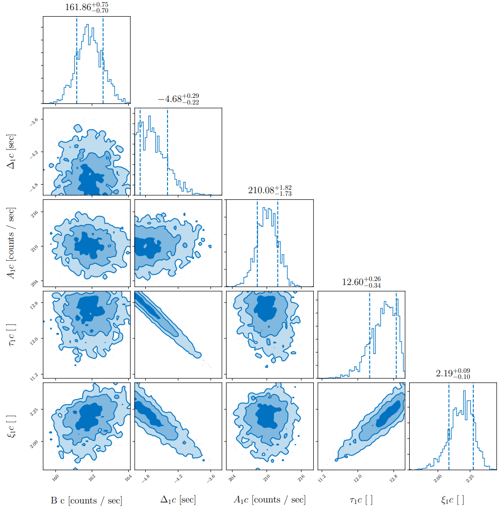

Usage
=====

.. role:: python(code)
   :language: python

.. figure:: ../images/BATSE_trigger_7475_rates_rates.png
   :figwidth: 80%
   :width: 80%
   :align: center
   :alt: BATSE trigger 7475

   BATSE trigger 7475

.. include::
  ../../../README.rst
  :start-after: inclusion-marker-usage-start
  :end-before: inclusion-marker-usage-end

----

The complete script for the above tutorial is here:

.. literalinclude:: ../../../examples/basic.py
    :name: basic.py
    :caption: basic.py

----

This will create three sets of files.

1.  Nested sampling posterior chains, which are stored as JSON files.

2.  Corner plots of the posteriors.

3.  Higher data products, the light-curves of each of the individual channels.
    These include by default analysis of the light-curve fit residuals to test for goodness-of-fit.

.. figure:: ../images/B_7475__d_NL200__rates_F.png
    :figwidth: 80%
    :width: 100%
    :align: center
    :alt: BATSE trigger 7475

    BATSE trigger 7475 with FRED fit

    BATSE trigger 7475 with FRED pulse fit on a single channel (channel 3).
    The green shaded regions are the 1-sigma statistical (Poisson) uncertainty.
    The correlogram is a visualisation of the autocorrelation of t5he residuals in the second panel.
    For a "good" fit, one expects 95% (99%) of the points to lie within the 95% (99%) confidence intervals.
    It is interesting to note in this case there is a sinusoidal structure all the way to the end of the pulse, even though the deviations from the fit are not large.
    The probability plot tests the divergence of the residuals from zero for normality.
    Again we see that the residuals are normally distributed to a good approximation.

    BATSE trigger 7475 with FRED pulse fit  on a single channel (channel 3) posterior corner plot.
    The parameter space is undersampled, (the posterior histograms are patchy), but that does not matter since this tutorial is for illustrative purposes only.

In answer to our initial question, pulse parameters may be read straight of the posterior distribution (or accessed through the posterior chain JSON file).
